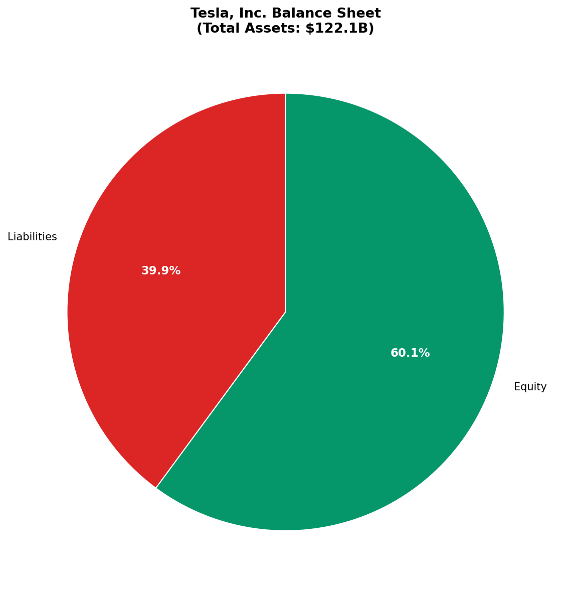
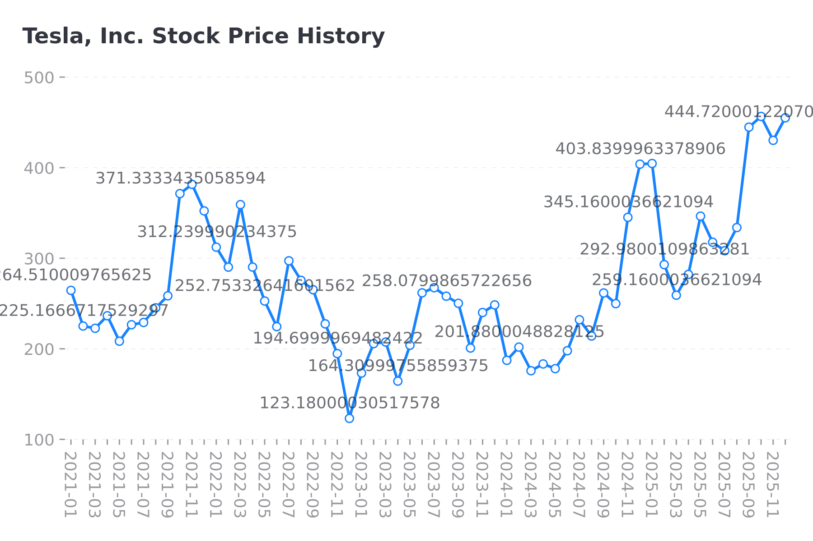

# Apple Inc. (AAPL) Investment Analysis

**Report Date:** December 05, 2025  
**Analyst:** FinSight AI Research System  
**Data Source:** Real-time financial data via yfinance API

---

# Executive Summary

Apple Inc. (AAPL) operates in the Consumer Electronics industry within the Technology sector.

**Key Highlights:**
- Current Stock Price: $278.78
- Market Cap: $4137.2B
- P/E Ratio: 37.3x
- Gross Margin: 46.9%
- ROE: 151.9%

---

## Company Overview

### Apple Inc. (AAPL)

**Sector:** Technology  
**Industry:** Consumer Electronics  
**Employees:** 166,000  
**Headquarters:** Cupertino, United States

### Business Description
Apple Inc. designs, manufactures, and markets smartphones, personal computers, tablets, wearables, and accessories worldwide. The company offers iPhone, a line of smartphones; Mac, a line of personal computers; iPad, a line of multi-purpose tablets; and wearables, home, and accessories comprising AirPods, Apple Vision Pro, Apple TV, Apple Watch, Beats products, and HomePod, as well as Apple branded and third-party accessories. It also provides AppleCare support and cloud services; and operates v

[Source: company_profile]

---

## Financial Performance

### Revenue Analysis
Apple Inc.'s revenue reached **$416.2B** in 2025,
representing **+6.4%** year-over-year growth [Source: income_statement].

**Revenue Trend:**
### Revenue Trend

| Year | Revenue ($B) |
|---|---|
| 2025 | $416.2 |
| 2024 | $391.0 |
| 2023 | $383.3 |
| 2022 | $394.3 |
| 2021 | $0.0 |

**4-Year CAGR:** 0.0%

### Net Income
Net income was **$112.0B** in 2025 [Source: income_statement].

[Source: income_statement]

---

## Profitability Analysis

### Key Margins
Apple Inc.'s profitability metrics [Source: financial_ratios]:

### Key Margins

| Metric | Value |
|---|---|
| Gross Margin | +46.9% |
| Operating Margin | +32.0% |
| Net Margin | +26.9% |
| Return on Equity (ROE) | +151.9% |

### Analysis
- **Strong gross margin** indicates pricing power and efficient operations
- **Excellent ROE of 151.9%** demonstrates efficient use of shareholder capital

[Source: financial_ratios]

---

## Balance Sheet Analysis

### Financial Position
Apple Inc.'s balance sheet summary [Source: balance_sheet]:

### Financial Position

| Metric | Value |
|---|---|
| Total Assets | $359.2 |
| Total Liabilities | $285.5 |
| Stockholders' Equity | $73.7 |
| Cash & Equivalents | $35.9 |
| Total Debt | $98.7 |

### Key Observations
- **Net debt of $62.7B** - moderate leverage
- **Equity ratio of 20.5%** indicates leveraged capital structure

[Source: balance_sheet]

---

## Stock Performance

### Current Position
Apple Inc. stock metrics [Source: stock_data]:

### Stock Metrics

| Metric | Value |
|---|---|
| Current Price | 278.8 |
| 52-Week High | 288.6 |
| 52-Week Low | 169.2 |
| Market Cap ($B) | 4,137.2 |

**Position in 52-Week Range:** 92%

### Technical Indicators
- 50-Day MA: $265.16
- 200-Day MA: $227.99
- Beta: 1.11

[Source: stock_data]

---

## Valuation Analysis

### Valuation Multiples
Apple Inc. trading metrics [Source: stock_data]:

### Valuation Multiples

| Metric | Value |
|---|---|
| P/E Ratio (TTM) | 37.32x |
| Forward P/E | 33.55x |
| P/S Ratio | 9.94x |
| P/B Ratio | 55.86x |

### Valuation Assessment
- Trading at **premium valuation** (37.3x P/E) - growth expectations priced in
- **Forward P/E (33.5x) below trailing** suggests expected earnings growth

[Source: stock_data]

---

# Investment Recommendation

## Rating: 🟡 **HOLD**

### Key Factors
- Premium valuation
- Strong ROE (151.9%)
- High gross margin (46.9%)

### Analyst Consensus
- Strong Buy: 5
- Buy: 23
- Hold: 15
- Sell: 1
- Strong Sell: 3
- **Total Analysts:** 47

### Risk Factors
- Market volatility and economic conditions
- Industry-specific challenges
- Company execution risks
- Regulatory changes

### Investment Thesis
Based on the analysis of financial metrics, valuation, and market position, 
we recommend investors consider the factors above when making investment decisions.

---

*This report was generated using the FinSight Two-Stage Writing Framework*  
*with Generative Retrieval for @import and [Source:] resolution.*

*Data collected: 2025-12-05 16:02:11*  
*Variables in memory: 13*

**Disclaimer:** This report is for informational purposes only and does not 
constitute investment advice. Past performance is not indicative of future results.
