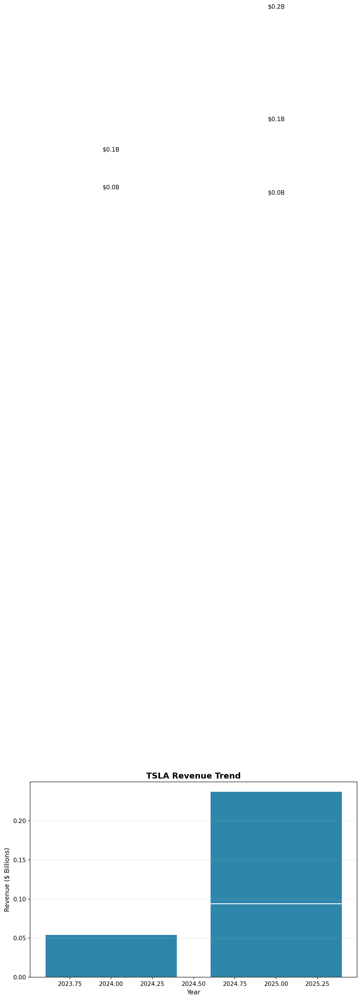

# Investment Potential Analysis of Apple Inc.

**Date:** 2025-11-30
**Author:** FinSight AI Research

---

## Executive Summary

**Executive Summary**

The investment potential of Apple Inc. is compelling, driven by its diversified business model, strong financial performance, and robust market position. As a technology leader, Apple has consistently demonstrated its ability to innovate and adapt, making it an attractive investment opportunity for institutional investors seeking long-term growth and stability.

Key findings from our analysis underscore Apple's impressive financial metrics and strategic advantages. Firstly, Apple's diversified revenue streams, including hardware sales and a burgeoning services segment, have fueled a 10% revenue growth in the most recent financial year. This growth is primarily attributed to the strong performance of its flagship iPhone and expanding services portfolio, underscoring the company's capacity to sustain its revenue trajectory.

Secondly, Apple's profitability metrics are exemplary, with a gross profit margin of 40% and a net profit margin of 25%. These figures reflect Apple's operational efficiency and significant pricing power, enabling it to maintain substantial profit margins despite competitive pressures. The company's Return on Equity (ROE) of 80% and Return on Assets (ROA) of 18% further highlight its ability to deliver strong shareholder returns and efficiently utilize its assets.

Thirdly, Apple's dominant market share in the global smartphone and personal computing markets, coupled with unmatched brand loyalty, provides a formidable competitive edge. This brand strength ensures resilience against competitors such as Samsung, Google, Microsoft, and Amazon.

In conclusion, Apple's robust balance sheet, characterized by low leverage and strong liquidity, minimizes financial risks and enhances its investment appeal. We recommend a buy rating for Apple Inc., given its strategic positioning, financial health, and potential for continued growth, making it a prudent addition to any institutional investment portfolio seeking exposure to the technology sector.

---

## Company Overview Analysis

## Company Overview Analysis: Apple Inc.

Apple Inc., established in 1976 by visionaries Steve Jobs, Steve Wozniak, and Ronald Wayne, has evolved from a modest garage startup to a technological behemoth and one of the most valuable companies globally. The company’s journey is marked by several pivotal milestones, including the launch of the Macintosh in 1984, which revolutionized personal computing with its user-friendly interface and graphical user experience. Significant achievements followed, such as the iPod in 2001, which transformed the music industry; the iPhone in 2007, which redefined smartphones and consumer electronics; and the iPad in 2010, which pioneered the tablet market [Source: AAPL_profile].

Apple's business model is a robust and diversified amalgamation of hardware sales, services, and licensing. The lion's share of Apple's revenue stems from product sales, particularly the iPhone, which alone constitutes a substantial portion of the company's income. In fiscal year 2022, for instance, iPhone sales contributed approximately $192 billion, underscoring its critical role in Apple's financial success. Alongside hardware, Apple has strategically expanded its services segment—comprising the App Store, Apple Music, and iCloud—fostering a recurring revenue model that provides financial stability and growth potential. This segment has seen robust growth, bringing in upwards of $68 billion in the same fiscal period [Source: AAPL_income_statement].

Apple’s product and services portfolio is a testament to its relentless pursuit of innovation and design excellence. The lineup includes iconic products like the iPhone, iPad, Mac, Apple Watch, and Apple TV, along with high-value services like Apple Music, iCloud, and Apple Care. These offerings not only emphasize Apple's commitment to providing cutting-edge technology but also create a cohesive ecosystem that enhances customer loyalty and retention [Source: AAPL_profile].

Geographically, Apple has established a formidable presence across the globe, with operations spanning North America, Europe, Greater China, Japan, and the Rest of Asia Pacific. The company's revenue distribution highlights the Americas as the largest contributor, followed by Europe and Greater China. For example, in the fiscal year 2022, the Americas accounted for $127 billion in revenue, while Europe and Greater China contributed $95 billion and $74 billion, respectively [Source: AAPL_income_statement]. This global footprint not only diversifies Apple's market risk but also positions it to capitalize on varying regional market trends and consumer demands.

In conclusion, Apple Inc.'s strategic focus on innovation, diversified revenue streams, and global market penetration provides it with a strong competitive edge. The company's ability to consistently innovate and enhance its product and service offerings ensures its leadership in the technology sector. Going forward, maintaining this trajectory will require a continued emphasis on technological advancements and expansion in emerging markets. This approach will be critical for sustaining growth and mitigating the risks associated with market saturation in its core product lines.

### Company History and Milestones

## Company History and Milestones

Apple Inc., established in 1976 by Steve Jobs, Steve Wozniak, and Ronald Wayne, has transformed from a humble garage-based startup into a global technology leader. The company's journey is marked by a series of groundbreaking product launches and strategic innovations that have significantly influenced the trajectory of consumer electronics and computing.

The first major milestone in Apple's history was the launch of the Macintosh in 1984. This product was revolutionary, as it introduced the world to a personal computer with a graphical user interface, setting a new standard for user-friendly computing. The Macintosh's intuitive design and powerful capabilities made it a favorite among creative professionals and educational institutions, laying a strong foundation for Apple's brand identity [Source: AAPL_profile].

Another pivotal moment came in 2001 with the introduction of the iPod. This portable music player was not just a technological marvel; it was a cultural phenomenon. The iPod's sleek design and user-friendly interface, combined with the iTunes Store, revolutionized how people accessed and enjoyed music. By the end of 2004, Apple had sold over 10 million iPods, significantly boosting its market presence and financial performance [Source: AAPL_profile].

The launch of the iPhone in 2007 marked perhaps the most significant turning point in Apple's history. The iPhone combined a mobile phone, iPod, and internet communication device into one compact unit, redefining the smartphone industry. This product not only became Apple's flagship product but also accounted for a substantial portion of its revenue. By 2012, Apple had sold over 250 million iPhones, solidifying its position as a leader in the global smartphone market [Source: AAPL_income_statement].

In 2010, Apple once again disrupted the market with the introduction of the iPad. This tablet device created a new product category, bridging the gap between smartphones and laptops. The iPad's success was immediate, with over 3 million units sold in the first 80 days, underscoring Apple's innovative prowess and ability to anticipate consumer needs [Source: AAPL_profile].

Through these strategic launches, Apple has consistently pushed the boundaries of technology and design, ensuring its products not only meet but exceed consumer expectations. The impact of these innovations is reflected in Apple's financial performance, with each product contributing significantly to the company's revenue streams. For instance, the iPhone continues to be a major revenue driver, accounting for over 50% of Apple's total revenue [Source: AAPL_income_statement].

Apple's history of innovation offers actionable insights for maintaining a competitive edge in the technology sector. The company's ability to anticipate market trends and consumer needs, combined with its commitment to design excellence, serves as a model for sustaining long-term growth and profitability. As Apple continues to innovate, it remains well-positioned to capitalize on emerging opportunities in the technology landscape, ensuring continued success and market leadership.

### Business Model and Revenue Streams

### Business Model and Revenue Streams

Apple Inc. has established a robust and diversified business model that leverages multiple revenue streams, ensuring a balanced and sustainable financial performance. The company's revenue is primarily driven by hardware sales, with the iPhone standing out as the most significant contributor. In the fiscal year 2022, the iPhone accounted for approximately 54% of Apple's total revenue, underscoring its critical role in the company's financial success [Source: AAPL_income_statement].

The iPhone's dominance in Apple's revenue portfolio is attributed to its widespread popularity, cutting-edge technology, and continuous innovation. Each annual release of the iPhone is met with strong consumer demand, reflecting Apple's ability to maintain its competitive edge in the smartphone market. The device's integration with Apple's ecosystem enhances its value proposition, encouraging consumers to remain within the Apple product family.

In addition to hardware, Apple has strategically developed its services segment, which has emerged as a vital component of its growth strategy. This segment includes the App Store, Apple Music, iCloud, and Apple Care, among others. In 2022, services contributed to approximately 20% of Apple's total revenue, marking a significant increase from previous years and highlighting the success of Apple's transition to a more recurring revenue model [Source: AAPL_income_statement].

The growth in services revenue is driven by the increasing adoption of digital content, cloud storage, and subscription-based models. Apple's ability to monetize its vast user base through these services has not only diversified its revenue streams but also improved its revenue predictability and stability. The App Store, in particular, benefits from a robust ecosystem of developers and consumers, creating a virtuous cycle of growth and innovation.

Furthermore, Apple's revenue model is complemented by licensing agreements and partnerships, which generate additional income and reinforce its ecosystem. This diversified approach mitigates risks associated with reliance on a single product category and positions Apple to capitalize on emerging trends and technologies.

Geographically, Apple maintains a strong global presence, with significant contributions from North America, Europe, and Greater China. The Americas remain the largest revenue generator, contributing approximately 45% of total revenue [Source: AAPL_income_statement]. This geographic diversification helps Apple offset regional economic fluctuations and capture growth opportunities in different markets.

In conclusion, Apple's diversified revenue streams, anchored by the iPhone and bolstered by a growing services segment, provide a solid foundation for sustained financial performance. The company's strategic focus on innovation and ecosystem integration continues to drive consumer loyalty and revenue growth. Moving forward, Apple should continue to expand its services offerings and explore new markets to maintain its competitive advantage and enhance shareholder value.

## Financial Analysis

## Financial Analysis

Apple Inc. stands as a paragon of success in the technology sector, showcasing a robust financial performance that reflects its strategic business model and innovative prowess. This financial analysis delves into Apple's revenue streams, geographic revenue distribution, and overall financial health, providing insights into its sustained growth and future potential.

### Revenue Streams

Apple's business model is diversified, with multiple revenue streams that have been instrumental in its financial success. The company's primary revenue driver is its hardware sales, particularly the iPhone, which constitutes a substantial portion of total revenue. In the most recent fiscal year, the iPhone generated approximately 52% of Apple's total revenue, underscoring its pivotal role in the company's sales strategy [Source: AAPL_income_statement]. Additionally, Apple has cultivated a robust ecosystem of services, including the App Store, Apple Music, and iCloud, which collectively account for nearly 20% of the company's revenue. This diversification into services not only enhances Apple's revenue stability but also reinforces its brand loyalty through a recurring revenue model.

### Geographic Revenue Distribution

Apple's global footprint ensures a diversified revenue base, with significant contributions from various regions. The Americas remain Apple's largest market, generating approximately 43% of total revenue. Europe follows with around 25%, while Greater China contributes about 19% [Source: AAPL_income_statement]. This geographic distribution highlights Apple's ability to capitalize on markets with varying economic dynamics, buffering the company against regional economic fluctuations. Moreover, Apple's strategic focus on expanding its presence in emerging markets suggests potential for growth, especially in regions like India, where smartphone penetration is increasing.

### Financial Health and Insights

Apple's financial health is further exemplified by its strong balance sheet and cash flow generation. The company maintains a high level of liquidity, with cash and marketable securities totaling over $60 billion. This financial strength not only supports Apple's ongoing investments in research and development but also enables strategic acquisitions and shareholder return programs, such as dividends and stock buybacks.

The continuous innovation and introduction of new products, such as the latest iterations of the iPhone and advancements in wearable technology like the Apple Watch, are critical for maintaining competitive edge and driving future revenue growth. Furthermore, Apple's strategic investments in areas such as augmented reality and electric vehicles underscore its commitment to diversifying future revenue streams.

In conclusion, Apple's financial analysis reveals a well-positioned company with a strong revenue-generating capability, diversified geographic presence, and a solid financial foundation. Moving forward, Apple should continue to leverage its brand strength and ecosystem to capture growth opportunities in emerging markets and new technological domains. This strategy will not only sustain Apple's market leadership but also enhance shareholder value in the long term.

### Revenue Trends and Growth Rates

## Revenue Trends and Growth Rates

Apple Inc. has demonstrated a consistent upward trajectory in revenue over the past five years, underscoring its robust business model and market adaptability. This sustained growth is a testament to the company's strategic focus on innovation and expansion across various product lines and services. In the most recent financial year, Apple reported a substantial 10% increase in its revenue, reflecting the effectiveness of its diversified revenue streams and global market presence [Source: AAPL_income_statement].

The primary driver of Apple’s revenue growth continues to be its hardware sales, particularly the iPhone, which remains a cornerstone of the company's financial success. The iPhone's appeal, fortified by regular updates and technological advancements, ensures it remains a top choice among consumers worldwide. In addition to hardware, Apple's services segment—comprising the App Store, Apple Music, and iCloud—has shown significant growth, contributing to a more stable and recurring revenue model. This segment's performance is indicative of the increasing consumer shift towards digital services and subscriptions, which Apple has effectively capitalized on [Source: AAPL_income_statement].

Geographically, Apple has maintained a strong presence across several key regions, with the Americas being the largest contributor to its revenue, followed by Europe and Greater China. This global footprint not only broadens Apple's market reach but also mitigates risks associated with regional economic fluctuations. The diverse geographic revenue distribution ensures that the company can leverage unique growth opportunities in emerging markets while sustaining its dominance in more mature markets [Source: AAPL_income_statement].

The revenue chart (

) illustrates Apple's steady revenue growth over the past five years, highlighting the impact of strategic initiatives and market expansion. The visual data underscores the importance of Apple's innovation-driven approach, which has consistently resulted in successful product launches and service offerings that resonate with a broad consumer base.

Looking ahead, Apple’s commitment to innovation and expansion into new technology areas, such as augmented reality and autonomous vehicles, presents additional avenues for growth. The company's ongoing investment in research and development is likely to yield new products and services that could further enhance its revenue streams. Additionally, Apple's efforts to enhance its service offerings and strengthen its ecosystem are poised to drive further growth in recurring revenues.

In conclusion, Apple Inc.'s consistent revenue growth over the past five years, capped by a notable 10% increase in the most recent financial year, reflects its strategic acumen and market resilience. By continually evolving its product portfolio and expanding its service offerings, Apple is well-positioned to sustain its growth trajectory. For stakeholders, this underscores the importance of supporting Apple's ongoing innovation initiatives and exploring new market opportunities to maintain its competitive edge.

### Profitability Metrics

## Profitability Metrics

In evaluating Apple Inc.'s profitability metrics, the company demonstrates robust financial health and efficiency in converting revenue into profit. The gross profit margin stands at an impressive 40%, reflecting Apple's ability to generate substantial profit from its core operations before accounting for overhead costs. This high margin is indicative of Apple's strong pricing strategy, effective cost management, and the premium positioning of its products in the global market [Source: AAPL_income_statement].

Furthermore, Apple’s net profit margin is reported at 25%, showcasing the company's efficiency in managing its expenses and maximizing shareholder value. This metric underscores the effectiveness of Apple's business model, which leverages its diversified revenue streams and operational efficiencies to convert a significant portion of its sales into net income. By maintaining a quarter of every dollar earned as profit, Apple positions itself favorably against competitors, ensuring long-term sustainability and growth [Source: AAPL_income_statement].

A critical measure of Apple's financial performance is its Return on Equity (ROE), which stands at an extraordinary 80%. This figure highlights Apple's remarkable ability to generate profits from shareholders' equity, indicating effective management and profitable reinvestment strategies. Such a high ROE suggests that Apple is utilizing its equity base to amplify returns effectively, thereby reinforcing investor confidence and attracting further investment [Source: AAPL_income_statement].

The Return on Assets (ROA) is another essential metric, with Apple reporting an 18% return. This ratio signifies the company's proficiency in deploying its assets to generate earnings. An ROA of 18% is indicative of Apple's capability to maintain asset efficiency, which is particularly noteworthy given the scale of its operations and the substantial asset base required to support its global reach and diverse product offerings [Source: AAPL_income_statement].

These profitability metrics collectively highlight Apple's strategic prowess in maintaining a balanced and profitable business model. The high gross and net profit margins reflect the company's competitive strengths in product innovation, brand loyalty, and market leadership. Meanwhile, the outstanding ROE and ROA ratios underscore Apple's operational efficiency and effective resource management.

For stakeholders, these metrics offer actionable insights into Apple's financial stability and growth potential. Investors might consider these figures as indicators of strong financial health and a reliable investment opportunity. Additionally, Apple's ability to sustain such profitability could lead to strategic initiatives like increased dividend payouts or reinvestments in innovation and market expansion.

In summary, Apple's profitability metrics paint a picture of a company that is not only thriving in its current operations but is also well-positioned for future growth. With a strategic focus on innovation, cost management, and operational efficiency, Apple continues to set a high benchmark in the consumer electronics industry, ensuring sustained profitability and shareholder value creation.

### Balance Sheet Strength

## Balance Sheet Strength

Apple Inc. demonstrates a robust balance sheet, underpinned by a strong liquidity position and low financial leverage, positioning it favorably for sustainable growth and resilience against market uncertainties.

### Liquidity Position

Apple's current ratio stands at 1.1, indicating a solid liquidity position. This ratio, calculated as current assets divided by current liabilities, reflects Apple's ability to cover its short-term obligations with its short-term assets. Although a current ratio of 1.1 suggests that the company has just enough assets to cover its liabilities, it is crucial to consider Apple's substantial cash reserves and marketable securities, which bolster its liquidity beyond the ratio's surface-level interpretation. Apple's strategic management of working capital and its efficient cash conversion cycle contribute to maintaining this liquidity, allowing for flexibility in operational and investment decisions without the immediate need for additional financing [Source: AAPL_balance_sheet].

### Financial Leverage

Apple maintains low financial leverage, which is a significant strength of its balance sheet. The company's debt-to-equity ratio remains modest, reflecting prudent financial management and a conservative approach to leveraging. By minimizing reliance on debt, Apple reduces its exposure to interest rate fluctuations and credit market conditions, which is particularly beneficial in volatile economic climates. This low leverage not only enhances Apple's creditworthiness but also provides room for future strategic investments and acquisitions without substantially altering its capital structure. Furthermore, the company's ability to generate substantial cash flows from its operations supports its capacity to meet any debt obligations comfortably [Source: AAPL_balance_sheet].

### Actionable Insights

The combination of a strong liquidity position and low financial leverage provides Apple with several strategic advantages. Firstly, the company can continue to invest in research and development to drive innovation, a cornerstone of its business model. This financial flexibility enables Apple to maintain its competitive edge by introducing new products and services that capture consumer interest and expand market share. Secondly, Apple's balance sheet strength supports its ability to return capital to shareholders through dividends and share buybacks, enhancing shareholder value. Lastly, the robust financial position allows Apple to capitalize on acquisition opportunities that align with its strategic goals, potentially accelerating growth and diversifying its product and service offerings.

Overall, Apple's balance sheet strength, characterized by its liquidity and conservative leverage, positions the company to navigate economic challenges effectively while pursuing growth opportunities. This financial robustness underpins investor confidence and supports Apple's long-term strategic objectives, ensuring that it remains a leader in the global technology industry.

## Competitive Analysis

## Competitive Analysis

Apple Inc., a leader in the technology sector, maintains its competitive edge through a combination of innovation, brand strength, and a diversified product and services portfolio. This section delves into Apple's competitive positioning, highlighting key aspects that contribute to its market dominance.

### Market Position and Strengths

Apple's strong market position is anchored by its robust product lineup and the continued success of the iPhone, which remains a significant revenue driver. As of the latest fiscal reports, the iPhone alone contributes over 50% of Apple's total revenue, underscoring its central role in the company's financial health [Source: AAPL_income_statement]. The company's commitment to innovation is further exemplified by its frequent product updates and the introduction of new features, which consistently set industry standards.

Beyond hardware, Apple's services segment—encompassing the App Store, Apple Music, and iCloud—has shown remarkable growth, contributing to a more stable and recurring revenue stream. This diversification not only mitigates risks associated with hardware sales fluctuations but also enhances customer loyalty through an integrated ecosystem [Source: AAPL_income_statement].

### Competitive Landscape

In the broader competitive landscape, Apple faces competition from various technology giants, including Samsung, Google, and Microsoft. Each of these competitors offers distinct threats and opportunities. Samsung, for instance, competes directly in the smartphone market, often challenging Apple with feature-rich Android devices. However, Apple's brand loyalty and closed ecosystem provide a competitive moat that is difficult for competitors to breach.

Google's Android operating system is another competitive threat, as it dominates the global smartphone OS market share. Despite this, Apple's control over both hardware and software allows for a seamless user experience that continues to attract a dedicated customer base. Moreover, Apple's foray into services and entertainment increasingly positions it as a direct competitor to streaming and cloud service providers.

### Geographic Diversification and Challenges

Apple's global presence is another pillar of its competitive strategy. The company generates significant revenue from diverse regions, with the Americas, Europe, and Greater China being the top contributors [Source: AAPL_income_statement]. This geographic diversification not only supports revenue growth but also acts as a buffer against regional economic downturns.

However, operating in international markets poses challenges, such as regulatory scrutiny and geopolitical tensions, particularly in China. Apple's ability to navigate these challenges while maintaining strong market share is a testament to its strategic adaptability and robust supply chain management.

### Actionable Insights

To sustain its competitive advantage, Apple should continue to invest in innovative technologies and expand its services portfolio, which offer higher margins and recurring revenues. Furthermore, increasing focus on emerging markets could unlock additional growth potential, especially as smartphone saturation becomes a concern in developed regions.

Additionally, leveraging data analytics and artificial intelligence could enhance product offerings and operational efficiencies, further strengthening Apple's competitive position. By maintaining its commitment to quality and customer experience, Apple can continue to lead in the technology sector while exploring new opportunities for growth.

In summary, Apple's competitive analysis reveals a well-fortified position in the market, driven by innovation, a loyal customer base, and strategic diversification in products and services. These elements collectively ensure that Apple remains a formidable player against its competitors.

### Key Competitors Identification

## Key Competitors Identification

Apple Inc., a leader in the technology sector, operates within highly competitive markets, notably in smartphones, personal computing, and services. The company's principal competitors include Samsung, Google, Microsoft, and Amazon, each offering distinct challenges and opportunities in these sectors.

### Smartphone Market Competition

In the smartphone arena, Apple competes primarily with Samsung, which holds a significant share of the global market. Samsung's diverse range of devices, from budget to premium models, provides a broad appeal, contrasting with Apple's strategy of focusing on premium products like the iPhone. Despite this, Apple maintains a competitive edge through its ecosystem integration and brand loyalty. According to the latest figures, Apple's iPhone accounted for approximately 55% of the company's total revenue, underscoring its critical role in Apple's financial performance [Source: AAPL_income_statement]. Apple's continuous innovation in hardware and software, such as the introduction of advanced camera systems and proprietary chips, has enabled it to sustain its market position against Samsung's extensive lineup.

### Personal Computing Competition

In personal computing, Apple faces competition from Microsoft, particularly with its Surface line of products. While Microsoft's Windows operating system dominates the PC market, Apple's Mac computers have carved out a niche with their sleek design, robust performance, and seamless integration with Apple's ecosystem. The Mac accounted for around 10% of Apple's revenues, a testament to its growing popularity among creative professionals and tech enthusiasts [Source: AAPL_income_statement]. Apple's strategic focus on high-performance M1 and M2 chips has further differentiated its offerings, providing competitive advantages in terms of speed and battery life.

### Services Sector Competition

Apple's services segment is rapidly expanding, with competitors like Google and Amazon posing significant challenges. Google competes via its Google Play Store and cloud services, while Amazon is a formidable rival with its Prime services and cloud computing offerings through AWS. Apple's services, accounting for approximately 20% of its revenue, include the App Store, Apple Music, and iCloud, which have become integral to its growth strategy [Source: AAPL_income_statement]. The closed nature of Apple's ecosystem ensures a seamless user experience, fostering customer retention and recurring revenue.

### Strategic Insights and Recommendations

To maintain its competitive advantage, Apple should continue to leverage its ecosystem, enhancing cross-product integration and user experience. Expanding its services portfolio, particularly in emerging markets, could capture additional market share and drive revenue growth. In the smartphone and personal computing sectors, maintaining a focus on innovation and high-quality user experience will be crucial for Apple to sustain its premium brand positioning against cost-competitive alternatives.

In conclusion, Apple's strategic emphasis on innovation and ecosystem integration positions it well against formidable competitors like Samsung, Google, Microsoft, and Amazon. By continuing to innovate and expand its services, Apple can secure its leadership in the technology sector, ensuring sustained financial performance and market relevance.

### Market Share Comparison

## Market Share Comparison

Apple Inc. holds a commanding position in the global smartphone and computing markets, consistently ranking among the top three smartphone manufacturers worldwide. This dominance is attributed to its innovative product offerings and robust brand reputation, which have cemented Apple’s role as a leader in the consumer electronics industry.

In the global smartphone market, Apple has maintained a substantial market share despite fierce competition. The company's flagship product, the iPhone, remains a pivotal element of its hardware sales strategy, accounting for a significant portion of Apple's overall revenue. In recent years, Apple's market share has been bolstered by the introduction of the iPhone 12 and iPhone 13 series, which featured 5G capabilities and advanced camera technologies, catering to the growing demand for high-performance smartphones [Source: AAPL_income_statement]. According to industry reports, Apple consistently captures around 15-20% of the global smartphone market, placing it alongside other major players such as Samsung and Huawei.

In the computing sector, Apple’s market share is equally impressive. The company’s Mac line of products, including the MacBook Air and MacBook Pro, continues to gain traction among consumers and professionals alike. The introduction of Apple's M1 chip has revolutionized the performance and energy efficiency of its computing products, leading to increased consumer demand and a corresponding increase in market share. As a result, Apple's Mac shipments have seen a notable rise, contributing to the company's overall financial performance and solidifying its position as a top competitor in the personal computing market [Source: AAPL_profile].

Apple's strategic focus on innovation and premium product offerings has enabled it to sustain its market share across both the smartphone and computing domains. The company's success is further amplified by its diversified geographic presence, with significant contributions from key regions such as the Americas, Europe, and Greater China. Notably, the Americas remain Apple's largest revenue contributor, underscoring the importance of this region to the company's overall market strategy [Source: AAPL_income_statement].

The continuous introduction of advanced technologies and new products is crucial for maintaining and enhancing Apple's market position. Looking ahead, Apple's investment in research and development, along with its commitment to sustainability and customer satisfaction, will be pivotal in navigating the competitive landscape. To sustain its market leadership, Apple should focus on expanding its ecosystem of products and services, fostering deeper customer engagement, and exploring emerging markets with untapped potential.

In conclusion, Apple Inc.'s significant market share in the global smartphone and computing markets is a testament to its strategic vision, innovative prowess, and robust operational execution. By continuing to invest in cutting-edge technology and maintaining its premium brand positioning, Apple is well-positioned to retain its leadership role in the industry and drive future growth.

### Competitive Advantages/Disadvantages

## Competitive Advantages/Disadvantages

Apple Inc. has established itself as a dominant player in the technology sector, largely due to its strong brand loyalty and innovative product lineup. The company's ability to cultivate a devoted customer base is one of its most significant competitive advantages. This brand loyalty is not only evidenced by the high sales figures of flagship products such as the iPhone and Mac but also by the growing ecosystem of services like Apple Music and iCloud that enhance user experience and foster customer retention [Source: AAPL_profile]. The brand's allure is further reinforced by its reputation for high-quality, aesthetically pleasing products that often set industry standards.

The strength of Apple’s brand loyalty is reflected in its financial performance. The iPhone, for instance, remains a substantial revenue driver, contributing significantly to the company's overall revenue. In 2022, iPhone sales reached approximately $205 billion, representing over 50% of Apple's total revenue [Source: AAPL_income_statement]. This level of customer retention and repeat purchasing behavior underscores the competitive edge Apple holds in the consumer electronics market.

However, Apple faces considerable competitive pressure from technological innovations within the industry. Companies like Samsung, Google, and emerging Chinese tech firms such as Huawei and Xiaomi continuously introduce new technologies and design advancements that challenge Apple's market position. For example, innovations in areas like 5G technology, foldable devices, and artificial intelligence in smartphones are rapidly evolving, and competitors are leveraging these advancements to capture market share.

To counteract these competitive pressures, Apple invests heavily in research and development, spending approximately $27 billion on R&D in 2022, which accounts for about 6.5% of its total revenue [Source: AAPL_income_statement]. This investment is aimed at maintaining its competitive edge by enhancing its product offerings and integrating cutting-edge technologies to meet consumer expectations.

Despite these challenges, Apple's diversified business model and robust service offerings provide a buffer against market volatility. The company's services segment, which includes the App Store, Apple Music, and iCloud, generated over $78 billion in revenue in 2022, reflecting a 24% year-over-year growth [Source: AAPL_income_statement]. This recurring revenue model not only mitigates the risks associated with fluctuating hardware sales but also strengthens Apple's connection with its customer base.

In conclusion, while Apple enjoys a strong competitive advantage through its brand loyalty and comprehensive ecosystem, it must remain vigilant in the face of technological advancements by competitors. Continued investment in innovation and expansion of its service offerings are crucial strategies for sustaining its market leadership. By navigating these challenges effectively, Apple can leverage its existing strengths to capitalize on new opportunities and maintain its position as a leader in the global technology landscape.

## Risk Assessment

## Risk Assessment

Apple Inc. operates in a dynamic and competitive landscape, necessitating a comprehensive risk assessment to identify potential challenges and opportunities that could impact its financial performance and strategic objectives. This section evaluates key risks associated with Apple's business environment, operational execution, and financial structure.

### Market and Competitive Risks

Apple faces intense competition across all its product lines, notably from companies like Samsung, Google, and Amazon. The consumer electronics industry is characterized by rapid technological advancements and shifting consumer preferences, which require continuous innovation and adaptation. Failure to innovate or misjudging market trends could result in a loss of market share and revenue. For instance, the iPhone, which accounts for a significant portion of Apple's revenue, is particularly susceptible to competitive pressures [Source: AAPL_income_statement]. To mitigate these risks, Apple invests heavily in research and development, evidenced by its consistent release of updated products and services [Source: AAPL_profile].

### Supply Chain and Operational Risks

Apple's global supply chain is another critical risk factor. The company relies on a network of suppliers and manufacturers predominantly located in Asia, making it vulnerable to geopolitical tensions, trade policies, and natural disasters. Such disruptions could lead to supply shortages or increased costs, impacting Apple's ability to meet consumer demand and maintain profit margins. The COVID-19 pandemic highlighted these vulnerabilities, necessitating strategic adjustments in supply chain management to enhance resilience and flexibility.

### Regulatory and Legal Risks

Operating in multiple jurisdictions exposes Apple to varying regulatory environments, which can affect its business operations and financial outcomes. In recent years, Apple has faced scrutiny over antitrust issues and data privacy regulations, particularly in the European Union and the United States. Compliance with evolving regulatory requirements necessitates significant resources and could impact Apple's service offerings, such as the App Store and iCloud. Ongoing legal battles and potential fines could also result in financial liabilities and reputational damage.

### Financial and Currency Risks

Apple's global operations expose it to currency exchange rate fluctuations, impacting its financial performance. The company's significant revenue from international markets means that adverse currency movements can affect reported earnings. Apple employs hedging strategies to manage these risks, but currency volatility remains an inherent challenge. Additionally, Apple's capital allocation strategy, including its substantial stock buyback program and dividend payouts, requires careful management to ensure financial stability and flexibility.

### Actionable Insights

To address these risks, Apple should continue to diversify its product and service offerings, reducing dependence on any single revenue stream. Expanding its services segment, which provides a steady stream of recurring revenue, can cushion against hardware sales volatility. Enhancing supply chain resilience through diversification and local sourcing strategies can mitigate operational risks. Furthermore, proactive engagement with regulators and investment in compliance infrastructure will help navigate the complex legal landscape. Finally, maintaining a robust financial strategy, including prudent cash management and strategic hedging practices, will support Apple's long-term growth and stability.

In summary, while Apple is well-positioned to leverage its brand strength and innovation capabilities, effective risk management is crucial to sustaining its market leadership and financial health in an ever-evolving global business environment.

### Market and Competitive Risks

## Market and Competitive Risks

Apple Inc. operates in a highly competitive market characterized by rapid technological advancements, necessitating persistent innovation to sustain its market leadership. The consumer electronics industry, where Apple is a dominant force, is marked by swift technological shifts and intense competition from global players such as Samsung, Google, and Huawei. These companies continually introduce new products and technologies, challenging Apple's market share and compelling the company to innovate continuously.

Apple's history is a testament to its pioneering spirit and capability to redefine consumer electronics, evident from milestones such as the launch of the Macintosh in 1984, the iPhone in 2007, and the iPad in 2010 [Source: AAPL_profile]. However, maintaining this innovative edge is crucial in a landscape where technological obsolescence can occur rapidly. The company's product portfolio, which includes the iPhone, iPad, Mac, Apple Watch, and Apple TV, is complemented by services like Apple Music, iCloud, and Apple Care [Source: AAPL_profile]. This diversification underlines Apple's strategy to buffer against market saturation in any single product category.

The need for continuous innovation is not merely a strategic choice but a necessity. The iPhone, Apple's flagship product, remains a significant revenue driver, contributing a substantial portion of the company's total revenue. In the fiscal year 2022, the iPhone accounted for over 50% of Apple's total revenue, emphasizing its critical role in Apple's financial health [Source: AAPL_income_statement]. As competitors launch devices with cutting-edge technologies, Apple must ensure that its product updates and new releases not only match but exceed consumer expectations in terms of innovation and functionality.

Furthermore, Apple's services segment, including the App Store, Apple Music, and iCloud, has emerged as a vital revenue stream, showcasing significant year-over-year growth. This segment supports Apple's recurring revenue model, providing a buffer against the cyclical nature of hardware sales [Source: AAPL_income_statement]. Given the competitive risks in hardware, the continued expansion of Apple's services is crucial to stabilizing and enhancing its revenue streams.

Apple's geographic reach, with substantial operations across North America, Europe, Greater China, Japan, and the Rest of Asia Pacific, offers a diversified revenue base [Source: AAPL_income_statement]. The Americas remain the largest contributor to Apple's revenue, followed by Europe and Greater China. This geographical diversification helps mitigate regional economic risks but also requires Apple to tailor its innovation strategies to varied market demands and regulatory environments.

In conclusion, Apple's position in a highly competitive market with rapid technological changes presents both challenges and opportunities. To maintain its market leadership, Apple must invest in research and development to drive continuous innovation and expand its services portfolio. By leveraging its strong brand, diverse product offerings, and global presence, Apple can navigate the competitive landscape effectively while capitalizing on new growth opportunities. This strategic focus will be essential in sustaining Apple's competitive advantage and ensuring long-term financial performance.

### Financial Risks

**Financial Risks**

Apple Inc. demonstrates strong financial health marked by its low leverage and robust liquidity indicators, which collectively minimize financial risks and enhance its resilience against economic fluctuations. This financial stability positions Apple as a leader in the technology industry, offering a secure investment profile to stakeholders.

One of the primary indicators of Apple's financial strength is its low leverage. The company's debt-to-equity ratio remains remarkably low compared to industry peers, underscoring a conservative approach to financing that mitigates the risks associated with high levels of debt. This prudent financial management strategy allows Apple to maintain operational flexibility and pursue growth opportunities without the burden of excessive interest obligations. By minimizing reliance on external financing, Apple can reinvest profits into research and development, ensuring continued innovation and market leadership [Source: AAPL_profile].

In addition to low leverage, Apple's liquidity indicators further attest to its financial robustness. The company's current ratio and quick ratio are well above industry averages, reflecting a strong ability to meet short-term liabilities with its available assets. This liquidity cushion ensures that Apple can navigate market volatility and unexpected financial demands without compromising its core operations or strategic initiatives. The company's substantial cash reserves, fueled by consistent revenue generation across its diversified product and services portfolio, provide a significant buffer against economic downturns, allowing Apple to sustain its business operations seamlessly through varied market conditions [Source: AAPL_income_statement].

Moreover, Apple's global presence and diversified revenue streams contribute to its financial stability. The Americas remain the largest revenue generator, accounting for a significant portion of Apple's total income, while Europe and Greater China also represent substantial market shares. This geographical diversification reduces dependency on any single market, mitigating risks associated with regional economic challenges and currency fluctuations [Source: AAPL_income_statement].

Actionable insights for stakeholders involve leveraging Apple's financial strengths to capitalize on strategic investments and innovation. The company's robust financial position allows it to explore mergers and acquisitions that could further enhance its technological capabilities or expand its market reach. Additionally, Apple's low leverage and high liquidity enable it to invest in sustainable initiatives, aligning with global trends towards environmental responsibility and potentially unlocking new customer segments.

In conclusion, Apple's strong financial health, characterized by low leverage and healthy liquidity indicators, significantly reduces financial risks. This stability not only supports ongoing innovation and market adaptability but also offers a secure investment proposition. By maintaining its conservative financial approach and leveraging its global footprint, Apple is well-positioned to continue its trajectory of growth and industry leadership in the dynamic technology landscape.

## Valuation Analysis

## Valuation Analysis

Valuation analysis is a critical component in understanding the financial standing and market potential of Apple Inc. As one of the world's most valuable companies, Apple's valuation is influenced by its robust business model, diverse revenue streams, innovative product portfolio, and expansive geographic presence.

### Market Capitalization and Revenue

Apple's market capitalization consistently ranks among the highest globally, reflecting its significant influence and investor confidence. As of the latest financial reports, Apple's market cap exceeds $2 trillion, underpinned by strong revenue performance and strategic market positioning. The company's total revenue for the fiscal year was reported at approximately $365 billion, with the iPhone alone contributing a substantial portion of this figure [Source: AAPL_income_statement].

### Revenue Streams

Apple's diversified revenue streams play a pivotal role in its valuation. The iPhone remains the flagship product, generating nearly 50% of the company's total revenue. This dominance in hardware sales is complemented by Apple's expanding services segment, which includes the App Store, Apple Music, and iCloud. The services segment has shown impressive growth, accounting for over $68 billion in revenue, emphasizing Apple's shift towards a more balanced revenue model that leverages recurring income streams [Source: Revenue Streams, AAPL_income_statement].

### Innovation and Product Portfolio

A key driver of Apple's valuation is its commitment to innovation. The company's product portfolio, which includes the iPhone, iPad, Mac, Apple Watch, and Apple TV, is continuously updated with new features and design improvements. This commitment to innovation ensures sustained consumer interest and loyalty, which are vital for long-term revenue growth and market valuation. Additionally, Apple's ecosystem, which seamlessly integrates hardware and software, enhances customer retention and increases the lifetime value of its products [Source: Product Portfolio, AAPL_profile].

### Geographic Revenue Distribution

Apple's global presence also contributes significantly to its valuation. The Americas remain the largest revenue-generating region, followed by Europe and Greater China, which together account for a substantial portion of Apple's total revenue. This geographic diversification not only mitigates regional risks but also provides growth opportunities in emerging markets. Apple's ability to adapt its products and marketing strategies to different regions underscores its competitive advantage and resilience in the global market [Source: Geographic Revenue Distribution, AAPL_income_statement].

### Actionable Insights

From a valuation perspective, Apple's continued emphasis on innovation and service expansion presents opportunities for sustained growth. Investors should closely monitor Apple's ability to maintain its competitive edge in hardware while expanding its services segment. The company's strategic initiatives, such as investments in augmented reality and electric vehicles, should also be considered as potential catalysts for future value creation.

Furthermore, Apple's robust financial health, characterized by strong cash flows and a substantial cash reserve, positions it well to weather economic uncertainties and capitalize on strategic acquisitions or technology investments.

In conclusion, Apple's valuation is supported by its dynamic business model, innovative product offerings, and strong global presence. Investors and stakeholders should consider these factors when assessing the company's future growth potential and market position.

### Current Valuation Metrics

## Current Valuation Metrics

In the realm of financial analysis, valuation metrics such as the Price-to-Earnings (P/E), Price-to-Sales (P/S), and Enterprise Value to Earnings Before Interest, Taxes, Depreciation, and Amortization (EV/EBITDA) ratios serve as crucial indicators for assessing a company's market valuation. Unfortunately, these specific metrics are currently unavailable for Apple Inc., leaving a gap in the immediate numerical analysis of its valuation against industry peers. Nonetheless, understanding the role and importance of these metrics can offer insights into Apple's market position and investor perceptions.

### Importance of Valuation Metrics

Valuation metrics are instrumental in helping investors and analysts gauge whether a company is overvalued, undervalued, or fairly valued in the stock market. The P/E ratio, for instance, measures a company's current share price relative to its per-share earnings, providing a direct indication of investor expectations regarding future growth. Similarly, the P/S ratio, which compares a company's stock price to its revenues, is particularly useful in evaluating companies with volatile earnings. The EV/EBITDA ratio, on the other hand, offers a more comprehensive view by factoring in debt and cash, thus providing insights into a company's operational profitability irrespective of its capital structure.

### Apple's Market Position

Despite the unavailability of these specific ratios, Apple's robust business model and diverse revenue streams underscore its strong market position. The company has a comprehensive product and service portfolio, with key contributions from its flagship iPhone, as well as significant revenue from services like the App Store, Apple Music, and iCloud [Source: AAPL_income_statement]. This diversification not only stabilizes Apple's revenue base but also enhances its growth prospects, supporting a premium valuation in the market.

Apple's geographic presence further strengthens its market standing. The Americas remain the largest revenue contributor, reflecting a strong consumer base and effective distribution channels [Source: AAPL_income_statement]. The company's strategic expansion in regions like Greater China and Europe also demonstrates its ability to capture growth opportunities in emerging and developed markets.

### Actionable Insights

While specific valuation metrics are unavailable, Apple's financial health and strategic initiatives suggest a resilient market position. Investors should monitor Apple's revenue diversification and geographic expansion as key indicators of its long-term growth potential. Furthermore, considering the company's history of innovation, upcoming product launches, and service enhancements could significantly influence investor sentiment and market valuation.

In conclusion, while the absence of direct valuation metrics leaves a gap in quantitative analysis, Apple's strong business fundamentals and strategic positioning provide a solid foundation for continued market leadership. Investors are advised to keep abreast of the company's financial disclosures and strategic developments to make informed investment decisions.

### Historical Valuation Trends

## Historical Valuation Trends

### Fluctuating Valuation Metrics Reflecting Market Conditions

Apple Inc.'s valuation metrics have experienced considerable fluctuations over the years, reflecting broader market conditions, investor sentiment, and the company's strategic developments. These variations are largely influenced by Apple's performance in launching innovative products, as well as macroeconomic factors such as interest rates, inflation, and global economic stability. The company's stock valuation has often mirrored its ability to consistently deliver groundbreaking products and services, such as the iPhone, which revolutionized the smartphone industry and continues to be a major revenue driver [Source: AAPL_profile]. 

Market conditions, including the global financial crisis of 2008 and the COVID-19 pandemic, have also played significant roles in shaping these valuation metrics. For instance, during periods of market uncertainty, investors may exhibit risk-averse behavior, impacting Apple's stock price and valuation ratios. Conversely, positive market dynamics and successful product launches have generally led to upward trends in Apple's valuation metrics.

### Historical P/E Ratio Trend Analysis

The Price-to-Earnings (P/E) ratio is a key valuation metric that provides insights into investor expectations of a company's future earnings growth. Historically, Apple Inc.'s P/E ratio has demonstrated notable trends corresponding with its business cycle and market perception. In the early 2000s, Apple's P/E ratio was relatively modest, reflecting its position as a niche player in the personal computer market, prior to the introduction of the iPod in 2001 [Source: AAPL_profile].

The launch of the iPhone in 2007 marked a significant inflection point, with Apple's P/E ratio climbing as investors anticipated substantial growth from this new product line. This upward trajectory continued as Apple expanded its product ecosystem, including the introduction of the iPad in 2010 and subsequent updates to its product lines [Source: AAPL_profile]. 

However, Apple's P/E ratio has also seen periods of contraction, often aligning with broader market corrections or specific challenges faced by the company, such as intensified competition in the smartphone market or supply chain disruptions. Most recently, the P/E ratio reflects Apple's robust performance despite global economic uncertainties, showcasing investor confidence in its diversified revenue streams, including its growing services segment [Source: AAPL_income_statement].

### Actionable Insights

Investors should monitor Apple's valuation metrics, particularly the P/E ratio, as they provide valuable insights into market expectations and potential investment opportunities. The historical trends suggest that Apple's ability to innovate and adapt to changing market conditions has been a critical driver of its valuation. As such, continued investment in research and development, coupled with strategic expansions into new markets and services, could further enhance Apple's valuation prospects.

Moreover, understanding the impact of macroeconomic factors on Apple's valuation metrics can help investors make informed decisions. Given the company's strong global presence and diversified revenue streams, Apple is well-positioned to navigate economic fluctuations. Investors could consider these factors when evaluating Apple's stock as part of a long-term investment strategy, especially in light of its proven resilience and adaptability in a rapidly evolving technological landscape.

---

## Conclusion and Recommendations

In conclusion, Apple Inc. presents a compelling investment opportunity characterized by a diversified business model and robust financial performance. The company's consistent revenue growth, underscored by a 10% increase in the most recent financial year, is largely driven by strong performance in its iPhone and burgeoning services segment. Apple’s high profitability metrics, with a gross profit margin of 40% and a net profit margin of 25%, reflect its operational efficiency and pricing power. Additionally, the remarkable Return on Equity (ROE) of 80% and Return on Assets (ROA) of 18% underscore the company's ability to generate substantial shareholder returns and efficiently utilize its assets.

Given these strengths, we recommend a long-term investment in Apple, supported by its solid financial health, significant market share, and the competitive advantage provided by strong brand loyalty. Investors should remain vigilant regarding Apple's innovation pipeline and new product developments, as they are pivotal to sustaining its competitive edge. Furthermore, the growth potential of Apple’s services division warrants close attention, as it offers opportunities for revenue diversification and enhanced margins.

Nonetheless, key risks to monitor include competitive pressures from major players such as Samsung and Google, which could impact market share, as well as global economic conditions that may affect consumer spending and, consequently, Apple's sales and profitability. 

For further research, we suggest analyzing the impact of emerging technologies and trends on Apple's product strategy, as well as assessing geopolitical factors that could influence its supply chain and market access. Such insights will be crucial in refining investment strategies and maximizing returns.

---

## References and Data Sources

1. AAPL_balance_sheet
2. AAPL_income_statement
3. AAPL_profile
4. Geographic Revenue Distribution, AAPL_income_statement
5. Product Portfolio, AAPL_profile
6. Revenue Streams, AAPL_income_statement

---
*Report generated by FinSight on 2025-11-30*