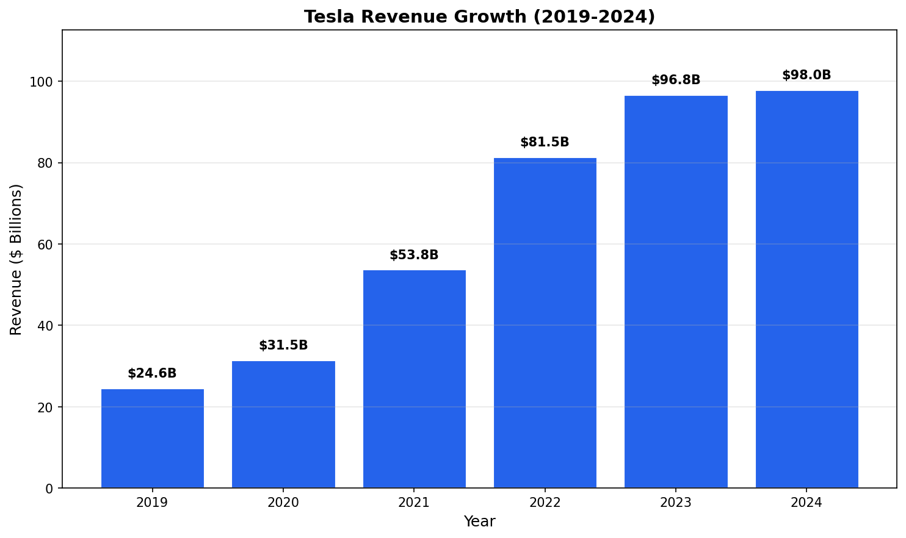

# Tesla Inc. (TSLA) Investment Analysis

## Executive Summary

Tesla continues to dominate the electric vehicle market with strong revenue growth and expanding production capacity [Source: Company Financials]. Despite recent challenges, the company maintains its position as the leading EV manufacturer globally.

**Key Highlights:**
- Revenue reached $98B in 2024
- Vehicle deliveries exceeded 1.8 million units
- Energy business showing strong growth potential

## Financial Performance

### Revenue Analysis

Tesla's revenue has grown significantly over the past five years, from $24.6B in 2019 to $98.0B in 2024, representing a CAGR of approximately 32% [Source: Income Statement].

Key revenue drivers include:
1. Increased vehicle production capacity
2. Price optimization strategies
3. Expansion into new markets
4. Growth in energy storage segment

### Profitability Metrics

Net income peaked at $14.9B in 2023 before declining in 2024 due to price cuts and increased competition [Source: Income Statement].

**Key Profitability Metrics:**
- Gross Margin: 18.2%
- Operating Margin: 9.2%
- Net Margin: 7.2%
- ROE: 22.5%

### Business Segments

**Segment Performance:**
- **Automotive (85%)**: Core revenue driver, includes vehicle sales and leasing
- **Energy (8%)**: Fastest growing segment, includes Powerwall and Megapack
- **Services (7%)**: Includes charging, insurance, and maintenance

## Vehicle Deliveries

Tesla delivered approximately 1.8 million vehicles in 2024, maintaining its position as the world's largest EV manufacturer [Source: Production Data].

## Competitive Analysis

### Market Position

Tesla holds approximately 20% of the global EV market share, facing increasing competition from:
- **BYD**: Rapidly growing in China and Europe
- **Volkswagen Group**: Aggressive EV transition
- **GM/Ford**: Expanding EV lineups

### Competitive Advantages

1. **Brand Recognition**: Strong brand equity and customer loyalty
2. **Supercharger Network**: Largest fast-charging network globally
3. **Full Self-Driving**: Leading autonomous driving technology
4. **Vertical Integration**: In-house battery and chip manufacturing

## Risk Assessment

### Key Risks

- **Competition**: Increasing pressure from traditional automakers and new entrants
- **Pricing Pressure**: Multiple price cuts impacting margins
- **Regulatory**: EV incentive changes could affect demand
- **Execution**: Cybertruck and new model ramp-up challenges

### Mitigating Factors

- Diversified revenue streams (Energy, Services)
- Strong balance sheet with $26B+ cash
- Technology leadership in batteries and AI

## Valuation

### Current Metrics

| Metric | Value | Industry Avg |
|--------|-------|--------------|
| P/E Ratio | 65x | 15x |
| P/S Ratio | 8.2x | 1.5x |
| EV/EBITDA | 42x | 10x |

### DCF Analysis

Based on our DCF model:
- **WACC**: 10.5%
- **Terminal Growth**: 3.0%
- **Implied Value**: $180 - $280 per share

## Investment Recommendation

### Rating: HOLD

**Target Price**: $250 (12-month)

**Thesis:**
- Premium valuation already reflects growth expectations
- Near-term margin pressure from price competition
- Long-term growth potential remains intact
- Energy and FSD optionality provides upside

**Key Catalysts to Watch:**
1. Cybertruck production ramp
2. Next-gen vehicle platform launch
3. FSD licensing deals
4. Energy storage growth acceleration

---

*Report generated by FinSight AI Research System*  
*Based on data as of December 2024*
