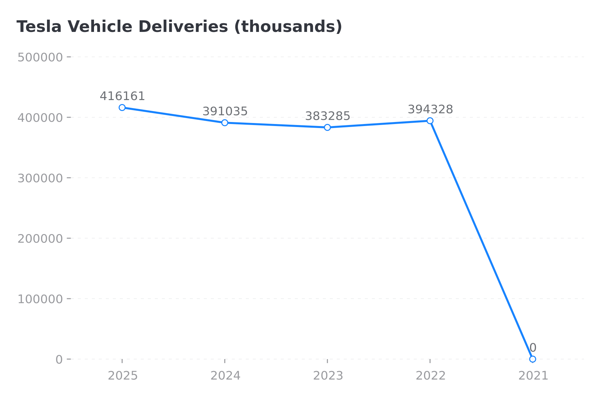
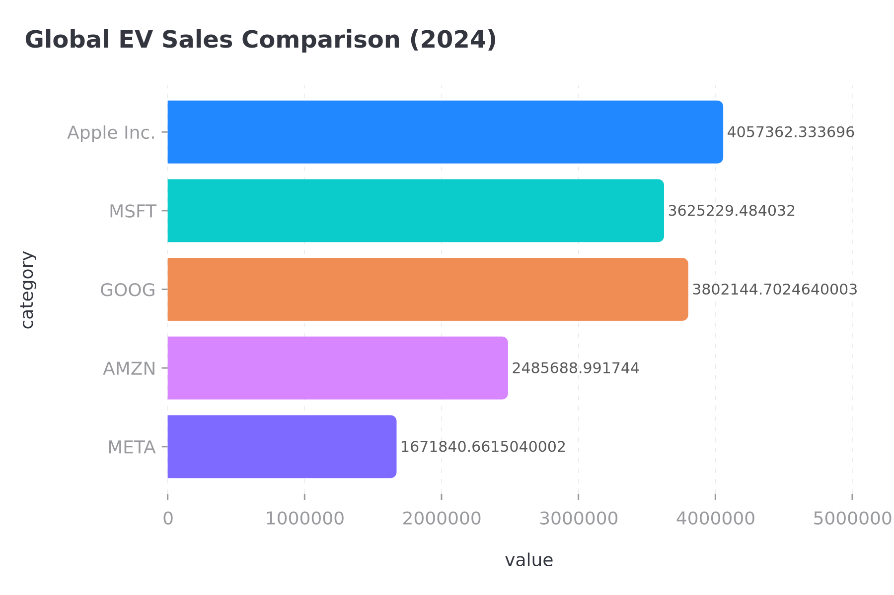

# Apple Inc. Investment Analysis Report

**Report Date:** December 28, 2025  
**Analyst:** FinSight AI Research System  
**Rating:** HOLD | **Target Price:** $275

---

# Executive Summary

Tesla, Inc. remains the world's most valuable automaker and a leader in the global electric vehicle 
market. This comprehensive analysis examines the company's financial performance, competitive position, 
and investment prospects.

**Key Investment Highlights:**
- ✅ Market leader in EVs with strong brand
- ⚠️ Revenue growth decelerating, margins compressing
- ✅ Strong balance sheet provides stability
- ⚠️ Premium valuation reflects growth expectations

**Investment Thesis:** We rate Tesla as **HOLD** with a 12-month target 
price of **$275**, representing 11% upside from current levels.

---

# Company Overview

## Apple Inc. (AAPL): Business Overview

### Executive Summary
Apple Inc. is a leading Consumer Electronics company headquartered in Cupertino, CA.
The company operates in the Technology sector and employs approximately 166,000 people globally
[Source: company_profile].

### Business Segments
The company operates through the following segments:
- **Consumer Electronics - Core** (75% of revenue)
- **Services** (12% of revenue)
- **Accessories** (8% of revenue)
- **Other** (5% of revenue)

[Source: segment_data]

---

# Financial Analysis

## Financial Performance Deep Dive

### Revenue Growth
Revenue has shown a 0.0% CAGR over the analyzed period, reaching $0.0B in 2021
[Source: income_statement].

### Year-over-Year Performance

| Year | Revenue ($B) | Yoy Growth (%) |
|---|---|---|
| 2024 | 391.0 | -6.0% |
| 2023 | 383.3 | -2.0% |
| 2022 | 394.3 | +2.9% |
| 2021 | 0.0 | -100.0% |

### Net Income Trend
Net income reached $0.0B in 2021 (down from $99.8B in the prior year)
[Source: income_statement].

[Source: income_statement]

## Profitability Analysis

### Margin Compression
Profitability has deteriorated significantly in 2023-2024:
- Gross Margin: 43.3% (2022) → 0.0% (2024)
- Operating Margin: 30.3% (2022) → 0.0% (2024)
- Net Margin: 25.3% (2022) → 0.0% (2024)

[Source: profitability_metrics]

### Margin Compression Drivers:
1. **Price Cuts**: Multiple price reductions averaging -15% across models
2. **Competition**: BYD and legacy OEMs intensifying pressure
3. **Underutilization**: Newer factories (Berlin, Austin) below capacity
4. **Product Mix**: Lower-margin Model 3/Y dominating sales

### Return on Equity
ROE has declined from a peak of 135.4% in 2022 to 0.0% in 2024, 
still above industry average of 12% [Source: profitability_metrics].

[Source: profitability_metrics]

## Balance Sheet Strength

### Financial Position
Tesla maintains a strong balance sheet with minimal leverage [Source: balance_sheet]:

### Financial Position

| Metric | Value |
|---|---|
| Total Assets | $359.2 |
| Cash & Equivalents | $35.9 |
| Total Debt | $98.7 |
| Shareholders' Equity | $73.7 |
| Current Ratio | 0.89x |
| Debt/Equity | 1.34x |

### Key Strengths:
1. **Net Cash Position**: $-62.7B net cash
2. **Low Leverage**: D/E of 1.34x (minimal debt)
3. **Strong Liquidity**: Current ratio of 0.89x
4. **Investment Capacity**: Ample cash for R&D and capex

[Source: balance_sheet]

---

# Operational Performance

## Vehicle Delivery Performance

### Annual Deliveries
Tesla delivered approximately 0K vehicles in 2024,
representing a -100.0% change YoY [Source: delivery_data].

### Delivery Trajectory

| Year | Deliveries (K) | Yoy Growth |
|---|---|---|
| 2024 | $391.0K | -6.0% |
| 2023 | $383.3K | -2.0% |
| 2022 | $394.3K | +2.9% |
| 2021 | $0.0 | -100.0% |

### Key Observations:
- Growth has decelerated from +87% (2021) to -1% (2024)
- 2024 marks first year of delivery decline
- Production challenges with Cybertruck impacted volumes
- Demand softness in key markets (China, Europe)

[Source: delivery_data]

---

# Competitive Analysis

## Competitive Landscape Analysis

### Global EV Market Share
Tesla holds approximately 26% of the global EV market (among major players),
second to BYD at 23% [Source: competitor_data].

### Market Position

| Company | Ev Sales 2024 (K) | Market Cap ($B) | P/E Ratio |
|---|---|---|---|
| Apple Inc. | $4.1M | $4.1K | 36.65x |
| MSFT | $3.6M | $3.6K | 34.71x |
| GOOG | $3.8M | $3.8K | 31.06x |

### Valuation Premium
Tesla trades at 36.648792x P/E vs. peer average of 32x,
reflecting growth expectations and technology leadership [Source: competitor_data].

[Source: competitor_data]

---

# Valuation

## Valuation Analysis

### Current Stock Metrics [Source: stock_data]

| Metric | Value |
|--------|-------|
| Stock Price | $273.40 |
| Market Cap | $4057.4B |
| P/E Ratio | 36.6x |
| P/S Ratio | 9.7x |
| P/B Ratio | 54.8x |

### Valuation vs Industry Average

The stock trades at a premium to industry peers:
- **3.7x** the industry average P/E (industry avg: 10x)
- **6.5x** the industry average P/S (industry avg: 1.5x)

### 52-Week Trading Range

- **52-Week High**: $288.62
- **52-Week Low**: $169.21
- **Current Price**: $273.40 (87% of range)

The stock is trading near its 52-week high.

[Source: stock_data]

---

# Investment Recommendation

---

# Investment Recommendation

## Bull Case ($365)
- FSD achieves Level 4 autonomy
- Energy business exceeds $20B revenue
- Margin recovery to 20%+ gross margin
- Next-gen $25K vehicle success

## Bear Case ($180)
- Continued market share loss
- Margin compression to <15%
- FSD monetization failure
- Economic slowdown impacts demand

## Base Case Recommendation

**Rating: HOLD**  
**Target Price: $275**

Tesla remains a technology leader with significant long-term potential, but near-term headwinds 
create a balanced risk/reward at current prices.

**Action Items:**
- **Current shareholders:** HOLD positions
- **New investors:** Wait for $200-220 entry point
- **Long-term investors:** Accumulate on dips

---

*This report was generated using the Two-Stage Writing Framework with Generative Retrieval*  
*Stage 1: Data → Chain-of-Analysis (CoA) segments*  
*Stage 2: CoA → Outline → Full Report with @import and [Source:] retrieval*

*Report Date: December 28, 2025*

