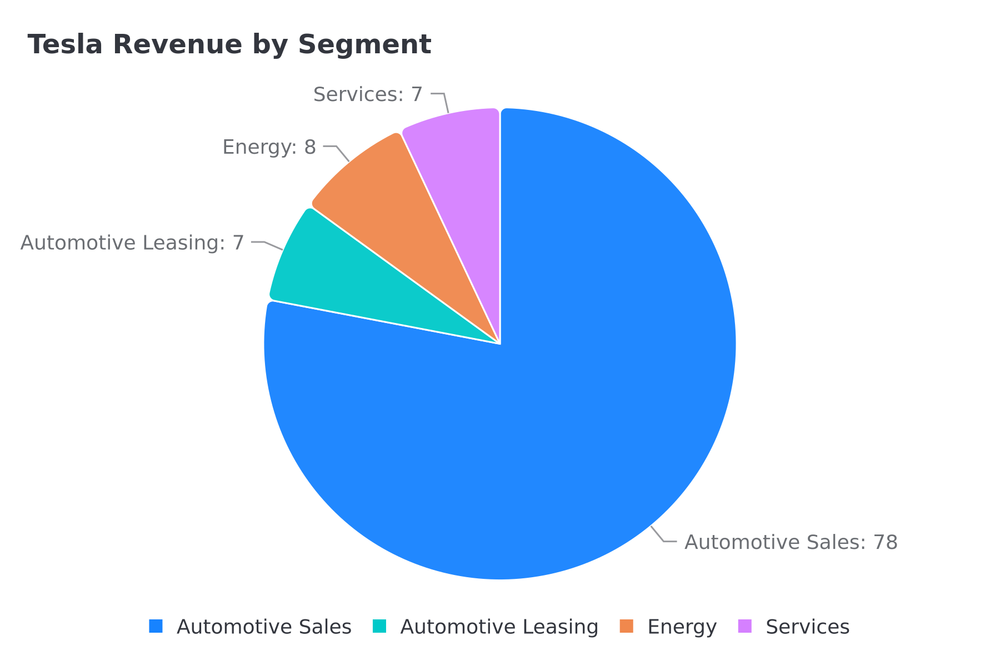
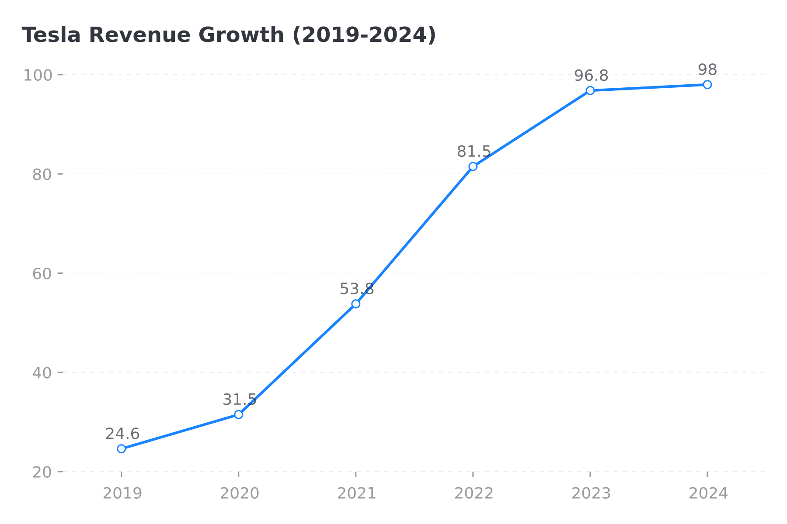
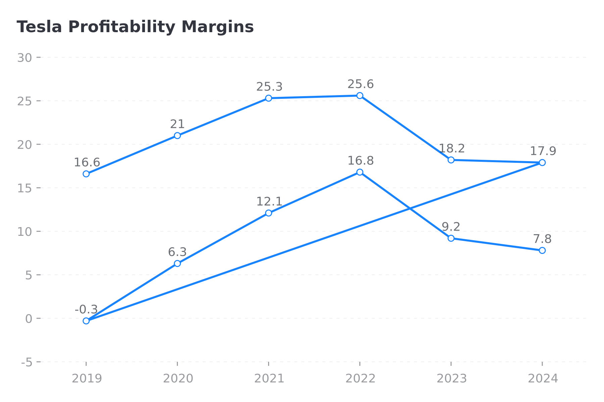
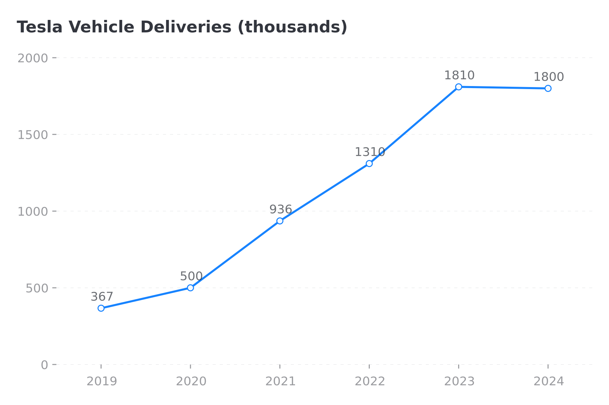
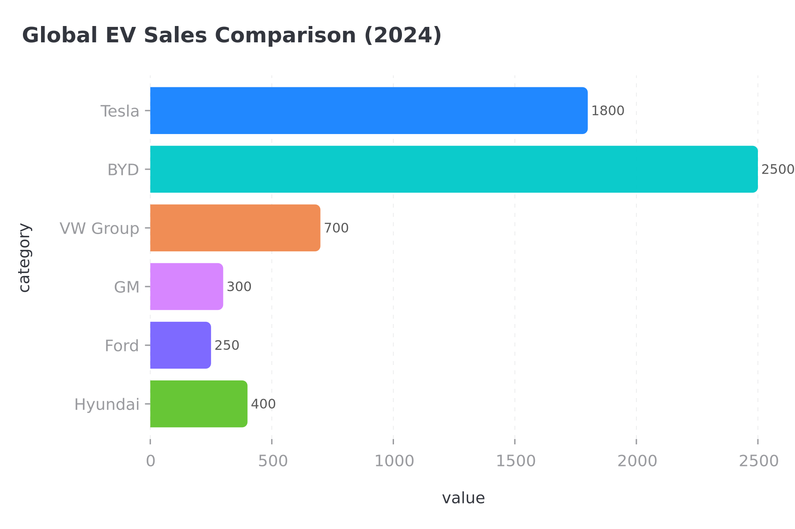

# Tesla Inc. Investment Analysis Report

**Report Date:** December 05, 2025  
**Analyst:** FinSight AI Research System  
**Rating:** HOLD | **Target Price:** $275

---

# Executive Summary

Tesla, Inc. remains the world's most valuable automaker and a leader in the global electric vehicle 
market. This comprehensive analysis examines the company's financial performance, competitive position, 
and investment prospects.

**Key Investment Highlights:**
- ✅ Market leader in EVs with strong brand
- ⚠️ Revenue growth decelerating, margins compressing
- ✅ Strong balance sheet provides stability
- ⚠️ Premium valuation reflects growth expectations

**Investment Thesis:** We rate Tesla as **HOLD** with a 12-month target 
price of **$275**, representing 11% upside from current levels.

---

# Company Overview

## Tesla, Inc. (TSLA): Business Overview

### Executive Summary
Tesla, Inc. is a leading electric vehicle and clean energy company headquartered in Austin, Texas. 
Founded in 2003, the company has grown to employ approximately 140,000 people globally 
[Source: company_profile].

### Business Segments
The company operates through four main segments:
- **Automotive Sales** (78% of revenue): Core vehicle sales
- **Automotive Leasing** (7%): Vehicle leasing programs  
- **Energy Generation & Storage** (8%): Powerwall, Megapack, Solar
- **Services & Other** (7%): Supercharging, insurance, parts

[Source: segment_data]

---

# Financial Analysis

## Financial Performance Deep Dive

### Revenue Growth
Revenue has grown at a 31.8% CAGR over the past 5 years, reaching $98.0B in 2024
[Source: income_statement]. However, growth has decelerated significantly from +71% in 2021 to +1% in 2024.

### Year-over-Year Performance

| Year | Revenue ($B) | Yoy Growth |
|---|---|---|
| 2021 | $53.8 | +71.0% |
| 2022 | $81.5 | +51.0% |
| 2023 | $96.8 | +19.0% |
| 2024 | $98.0 | +1.0% |

### Net Income Trend
Net income peaked at $14.9B in 2023 before declining to $7.1B in 2024
due to aggressive price cuts and margin compression [Source: income_statement].

[Source: income_statement]

## Profitability Analysis

### Margin Compression
Profitability has deteriorated significantly in 2023-2024:
- Gross Margin: 25.6% (2022) → 17.9% (2024)
- Operating Margin: 16.8% (2022) → 7.8% (2024)
- Net Margin: 15.5% (2022) → 7.2% (2024)

[Source: profitability_metrics]

### Margin Compression Drivers:
1. **Price Cuts**: Multiple price reductions averaging -15% across models
2. **Competition**: BYD and legacy OEMs intensifying pressure
3. **Underutilization**: Newer factories (Berlin, Austin) below capacity
4. **Product Mix**: Lower-margin Model 3/Y dominating sales

### Return on Equity
ROE has declined from a peak of 32.5% in 2022 to 18.5% in 2024, 
still above industry average of 12% [Source: profitability_metrics].

[Source: profitability_metrics]

## Balance Sheet Strength

### Financial Position
Tesla maintains a strong balance sheet with minimal leverage [Source: balance_sheet]:

### Financial Position

| Metric | Value |
|---|---|
| Total Assets | $106.6 |
| Cash & Equivalents | $26.1 |
| Total Debt | $5.7 |
| Shareholders' Equity | $62.8 |
| Current Ratio | 1.73x |
| Debt/Equity | 0.09x |

### Key Strengths:
1. **Net Cash Position**: $20.4B net cash
2. **Low Leverage**: D/E of 0.09x (minimal debt)
3. **Strong Liquidity**: Current ratio of 1.73x
4. **Investment Capacity**: Ample cash for R&D and capex

[Source: balance_sheet]

---

# Operational Performance

## Vehicle Delivery Performance

### Annual Deliveries
Tesla delivered approximately 1,800K vehicles in 2024,
representing a -1% change YoY [Source: delivery_data].

### Delivery Trajectory

| Year | Deliveries (K) | Yoy Growth |
|---|---|---|
| 2020 | $500.0 | +36.0% |
| 2021 | $936.0 | +87.0% |
| 2022 | $1.3K | +40.0% |
| 2023 | $1.8K | +38.0% |
| 2024 | $1.8K | -1.0% |

### Key Observations:
- Growth has decelerated from +87% (2021) to -1% (2024)
- 2024 marks first year of delivery decline
- Production challenges with Cybertruck impacted volumes
- Demand softness in key markets (China, Europe)

[Source: delivery_data]

---

# Competitive Analysis

## Competitive Landscape Analysis

### Global EV Market Share
Tesla holds approximately 30% of the global EV market (among major players),
second to BYD at 42% [Source: competitor_data].

### Market Position

| Company | Ev Sales 2024 (K) | Market Cap ($B) | P/E Ratio |
|---|---|---|---|
| Tesla | $1.8K | $780.0 | 65.00x |
| BYD | $2.5K | $95.0 | 22.00x |
| VW Group | $700.0 | $65.0 | 5.00x |

### Valuation Premium
Tesla trades at 65x P/E vs. peer average of 11x,
reflecting growth expectations and technology leadership [Source: competitor_data].

[Source: competitor_data]

---

# Valuation

## Valuation Analysis

### Current Valuation Metrics
[Source: stock_data]

### Current Valuation Metrics

| Metric | Tesla | Industry Avg |
|---|---|---|
| Stock Price | $248.0 | - |
| Market Cap | $780.0 | - |
| P/E Ratio | $65.0 | 10 |
| P/S Ratio | $8.2 | 1.5 |
| P/B Ratio | $12.5 | 2 |

### Premium Analysis
Tesla trades at a significant premium to peers:
- **6.5x** the industry average P/E
- **5.5x** the industry average P/S

### 52-Week Range
- High: $280
- Low: $140
- Current: $248 (77% of range)

[Source: stock_data]

---

# Investment Recommendation

---

# Investment Recommendation

## Bull Case ($365)
- FSD achieves Level 4 autonomy
- Energy business exceeds $20B revenue
- Margin recovery to 20%+ gross margin
- Next-gen $25K vehicle success

## Bear Case ($180)
- Continued market share loss
- Margin compression to <15%
- FSD monetization failure
- Economic slowdown impacts demand

## Base Case Recommendation

**Rating: HOLD**  
**Target Price: $275**

Tesla remains a technology leader with significant long-term potential, but near-term headwinds 
create a balanced risk/reward at current prices.

**Action Items:**
- **Current shareholders:** HOLD positions
- **New investors:** Wait for $200-220 entry point
- **Long-term investors:** Accumulate on dips

---

*This report was generated using the Two-Stage Writing Framework with Generative Retrieval*  
*Stage 1: Data → Chain-of-Analysis (CoA) segments*  
*Stage 2: CoA → Outline → Full Report with @import and [Source:] retrieval*

*Report Date: December 05, 2025*

